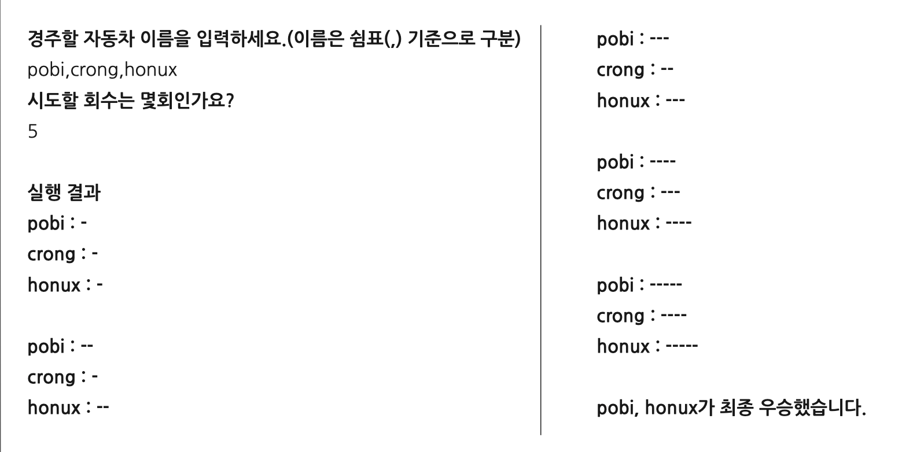

# 미션 - 자동차 경주 게임

## 구현할 기능 목록 
- [x] 차의 이름과 위치를 관리하는 클래스를 구현한다.
- [x] 0부터 9사이의 정수값을 랜덤하게 생성
- [x] 난수가 4이상이면 전진
- [x] 난수가 3이하이면 이동하지 않는다
- [x] 턴이 모두 지났을 때 가장 앞에 있는 차의 이름을 출력한다.
- [x] 턴이 모두 지났을 때 앞에 있는 차가 2개 이상일 경우 전부 출력한다.
- [x] 차의 이름에 대한 입력값을 쉼표로 구분할 수 있다.
- [x] 시도할 횟수를 입력 받을 수 있다.  
- [x] 현재 자동차의 위치상황을 이름과 함께 출력할 수 있다.

## 예외 처리 목록
- [x] 빈 문자열 입력은 허용하지 않는다.
- [x] 중복되는 이름의 차를 입력했을 때 허용하지 않는다.
- [x] 시도할 횟수로 숫자가 아닌 값을 입력했을 때 허용하지 않는다.

## 🚀 기능 요구사항

- 주어진 횟수 동안 n대의 자동차는 전진 또는 멈출 수 있다.
- 각 자동차에 이름을 부여할 수 있다. 전진하는 자동차를 출력할 때 자동차 이름을 같이 출력한다. •자동차 이름은 쉼표(,)를 기준으로 구분하며 이름은 5자 이하만 가능하다.
- 사용자는 몇 번의 이동을 할 것인지를 입력할 수 있어야 한다.
- 전진하는 조건은 0에서 9 사이에서 random 값을 구한 후 random 값이 4 이상일 경우 전진하고, 3 이
하의 값이면 멈춘다.
- 자동차 경주 게임을 완료한 후 누가 우승했는지를 알려준다. 우승자는 한 명 이상일 수 있다.

<br>

## ✍🏻 입출력 요구사항



<br>

## 🎱 프로그래밍 요구사항 - 1주차와 동일
- 자바 코드 컨벤션을 지키면서 프로그래밍한다.
    - 기본적으로 [Google Java Style Guide](https://google.github.io/styleguide/javaguide.html) 문서와 [네이버 핵데이 Java 컨벤션](https://naver.github.io/hackday-conventions-java/)을 원칙으로 한다.
    - 단, 들여쓰기는 '2 spaces'가 아닌 '4 spaces'로 한다.
- indent(인덴트, 들여쓰기) depth를 3이 넘지 않도록 구현한다. 2까지만 허용한다.
    - 예를 들어 while문 안에 if문이 있으면 들여쓰기는 2이다.
    - 힌트: indent(인덴트, 들여쓰기) depth를 줄이는 좋은 방법은 함수(또는 메소드)를 분리하면 된다.
- 3항 연산자를 쓰지 않는다.
- 함수(또는 메소드)가 한 가지 일만 하도록 최대한 작게 만들어라.
- System.exit 메소드를 사용하지 않는다.
- 비정상적 입력에 대해서는 IllegalArgumentException을 발생시킨다.

### 프로그래밍 요구사항 - 2주차 추가
- 함수(또는 메소드)의 길이가 15라인을 넘어가지 않도록 구현한다. 
    - 함수(또는 메소드)가 한 가지 일만 잘 하도록 구현한다.
- else 예약어를 쓰지 않는다.
    - 힌트: if 조건절에서 값을 return하는 방식으로 구현하면 else를 사용하지 않아도 된다.
    - else를 쓰지 말라고 하니 switch/case로 구현하는 경우가 있는데 switch/case도 허용하지 않는다.

### 프로그래밍 요구사항 - 객체
- 다음 Car 객체를 활용해 구현해야 한다. 
- Car 기본 생성자를 추가할 수 없다. 
- name, position 변수의 접근 제어자인 private을 변경할 수 없다. 
- 가능하면 setPosition(int position) 메소드를 추가하지 않고 구현한다.

```java
public class Car {
    private final String name;
    private int position = 0;
    
    public Car(String name) {
        this.name = name;
    }
    
    // 추가 기능 구현
}
```

<br>

## 📈 진행 요구사항
- 미션은 현재 저장소를 fork & clone해서 시작한다.
- 기능을 구현하기 전에 java-baseball-precourse/README.md 파일에 구현할 기능 목록을 정리해 추가한다.
- git의 commit 단위는 앞 단계에서 README.md 파일에 정리한 기능 목록 단위로 추가한다.
    - [AngularJS Commit Message Conventions](https://gist.github.com/stephenparish/9941e89d80e2bc58a153) 참고해 commit log를 남긴다.

<br>

## 📝 License

This project is [MIT](https://github.com/woowacourse/java-baseball-precourse/blob/master/LICENSE) licensed.
